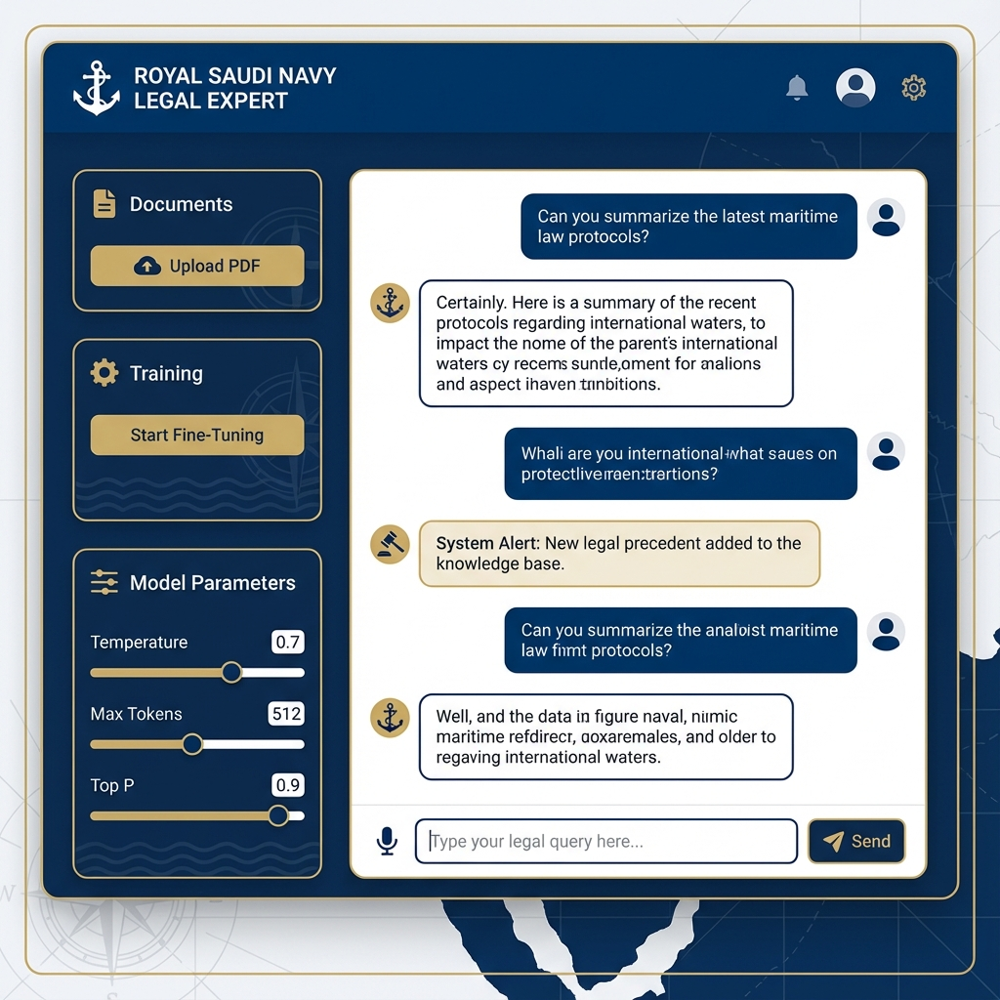

# Royal Saudi Navy Legal Expert System 🚢⚖️ | Modular Portfolio Edition

## Project Overview
This project is a state-of-the-art **RAG (Retrieval-Augmented Generation)** system fine-tuned to act as a legal expert on Royal Saudi Navy jurisdiction and maritime law. It features a fully modular architecture with a robust **FastAPI** backend and a modern **React/Vite** frontend.

**Base Model:** Meta Llama 3.2 1B Instruct
**Fine-Tuning Method:** LoRA (Low-Rank Adaptation)
**Architecture:** Modular (FastAPI + React)



## Key Features
- **Modern Full-Stack Architecture**: Clean separation of concerns with a RESTful API and a responsive web UI.
- **Automated Pipeline**: End-to-end workflow from PDF upload to dataset generation to model fine-tuning.
- **Interactive Chat UI**: A professional web interface for querying the legal expert.
- **Efficient Fine-Tuning**: Optimized LoRA configuration for consumer GPUs.

## Directory Structure
```
portfolio/
├── backend/               # FastAPI Backend
│   ├── src/
│   │   ├── api/          # API Endpoints (main.py)
│   │   ├── data/         # Data Processing (PDF extraction, Q&A gen)
│   │   ├── model/        # Model Engine (Fine-tuning, Inference)
│   │   └── utils/        # Config and Utilities
│   ├── .env              # Environment Variables
│   └── requirements.txt  # Python Dependencies
├── frontend/              # React + Vite Frontend
│   ├── src/              # React Components
│   └── ...
└── README.md             # Project Documentation
```

## Prerequisites
- Node.js & npm
- Python 3.8+
- CUDA-enabled GPU (Standard T4 or better recommended)
- Hugging Face account

## Installation & Setup

### 1. Backend Setup
Navigate to the `backend` directory:
```bash
cd portfolio/backend
pip install -r requirements.txt
```
**Configuration**:
Edit `portfolio/backend/.env`:
```env
HF_TOKEN=your_token_here
# Optional: Path to your Google Drive for model backup
GOOGLE_DRIVE_PATH=C:/Users/YourUser/Google Drive/Models
```

**Run Server**:
```bash
uvicorn src.api.main:app --reload
```

### 2. Frontend Setup
Navigate to the `frontend` directory:
```bash
cd portfolio/frontend
npm install
npm run dev
```

## Usage Workflow

### 👨‍💻 Developer Mode (Training)
1.  **Configure**: Set `GOOGLE_DRIVE_PATH` in `.env`.
2.  **Upload**: Upload the PDF documentation via the UI.
3.  **Train**: Click "Start Fine-Tuning".
    - The model will train on the backend.
    - **Auto-Save**: Upon completion, the fine-tuned model is automatically backed up to your Google Drive folder.

### 👤 End-User Mode (Chatting)
1.  **Chat**: The system automatically detects the fine-tuned model on Google Drive.
2.  **Interact**: Users can immediately start querying the legal expert. The backend prefers the Google Drive version for inference, ensuring consistent access to the production model.

## unique Technical Highlights
- **FastAPI**: Asynchronous request handling for high-performance ML inference.
- **Vite**: Ultra-fast frontend tooling for detailed UI development.
- **LoRA**: Parameter-efficient fine-tuning strategy.
